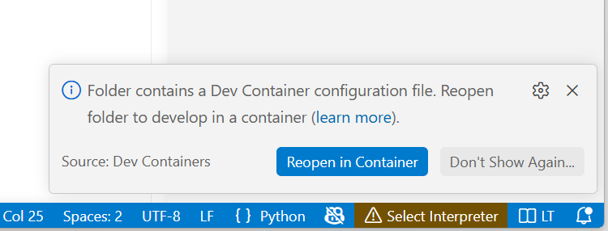
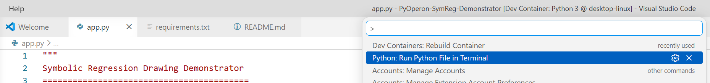
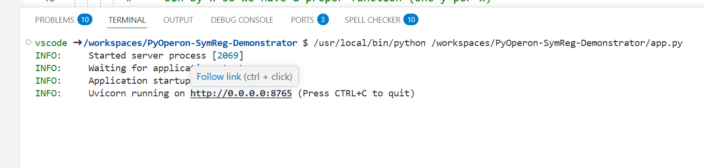
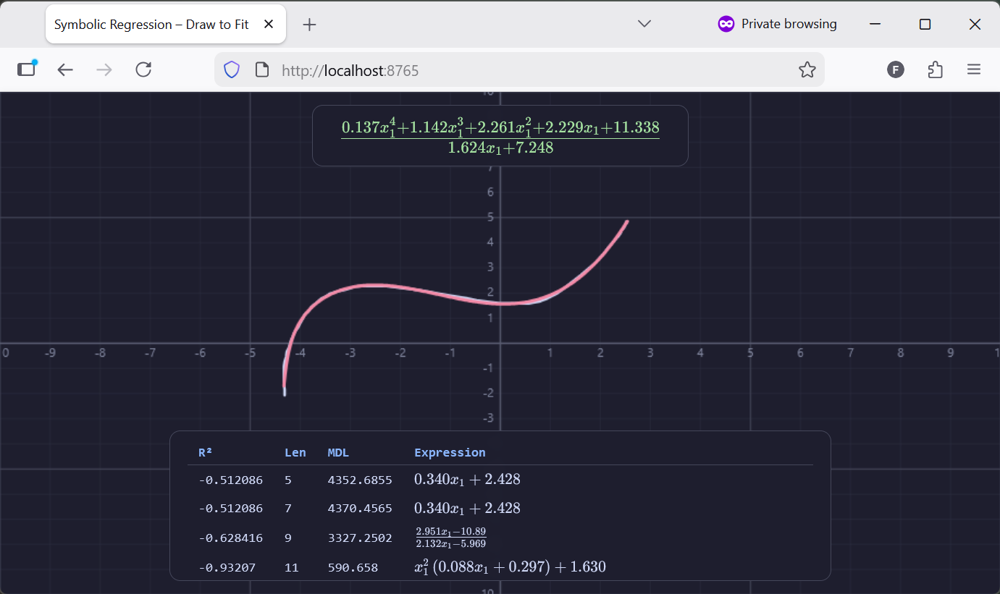

# SymReg Demonstrator

Interactive symbolic regression demo — draw a curve and get a fitted mathematical expression via [PyOperon](https://github.com/heal-research/pyoperon).

## Demo


## Credits
A great *Thank You* to my dear friends and colleagues:
- **Lukas Kammerer** ([@LukasCamera](https://github.com/LukasCamera)) — for the original C# implementation and concept this app is based on
- **Bogdan Burlacu** ([@foolnotion](https://github.com/foolnotion)) — for the [PyOperon](https://github.com/heal-research/pyoperon) symbolic regression library
and to:
- **Claude Opus** — for code generation

## Usage

```bash
pip install -r requirements.txt
python app.py
```

Then open `http://localhost:8765` in your browser.

## Usage - VSCode

**1. Open in Dev Container**

Reopen the folder in a VS Code Dev Container:



**2. Run the App**

Press `F1` → *Run Python File in Terminal*:



**3. Open in Browser**

Click the link in the terminal to open `http://localhost:8765`:



**4. Draw & Fit**

Draw any curve on the canvas. PyOperon fits a symbolic expression in the background. Select solutions from the Pareto front panel. Redrawing cancels any in-progress run.


